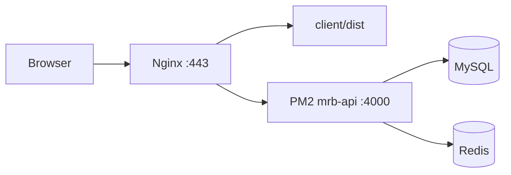

# Production Readiness Report

**Project:** MRB Learning Platform  
**Date:** 2026-06-21  
**Target:** Single Ubuntu 24.04 VPS — PM2 + Nginx + MySQL + Redis + Let's Encrypt

---

## 1. Current Architecture Analysis

### Application Stack

| Layer | Technology | Production role |
|-------|------------|-----------------|
| Frontend | React 18 + Vite 5 | Static SPA in `client/dist/` |
| Backend | Node.js + Express (ESM) | API on loopback `:4000` via PM2 |
| Database | MySQL 8 | Primary persistence |
| Cache/Queue | Redis + BullMQ | Email queue, rate limits, webhook dedupe |
| Edge | Nginx | TLS, static files, reverse proxy, rate limits |

### Request Flow



### Existing Strengths (Pre-Deployment Work)

- Centralized production startup validation (`validateProductionStartup.js`)
- Idempotent schema/migration runners on API boot
- Comprehensive security test suites (auth, XSS, uploads, webhooks, enrollment)
- CEE protection grid for entitlement enforcement
- HttpOnly cookies + CSRF + JWT refresh rotation
- Webhook raw-body HMAC verification
- Winston logging infrastructure
- Observability endpoints (`/api/health`, `/api/ready`, `/api/metrics`)

### Gaps Identified (Pre-Deployment Work)

- No unified `./deploy.sh` workflow
- No PM2 ecosystem configuration
- No Nginx production config
- No graceful shutdown for zero-downtime PM2 reloads
- No root environment template or pre-deploy validation
- No documented backup/restore procedures
- Docker Compose prod exposed API port (alternative path, not used for VPS guide)
- README referenced MongoDB (not used — documentation drift)

---

## 2. Problems Found

| # | Problem | Impact | Severity |
|---|---------|--------|----------|
| P1 | No single-command deploy | Manual error-prone releases | High |
| P2 | API could bind `0.0.0.0` | Unnecessary exposure if UFW misconfigured | High |
| P3 | No SIGTERM graceful shutdown | Corrupted in-flight requests on restart | High |
| P4 | Frontend build not validated in CI/deploy | Broken admin shell in production | Medium |
| P5 | TRUST_PROXY not enforced pre-deploy | Broken cookies/IP rate limits | Critical |
| P6 | No Nginx rate limits at edge | DDoS/brute-force relies on Node only | Medium |
| P7 | No backup automation scripts | Data loss risk | High |
| P8 | Vite dev plugins in production build | Unnecessary dev overlay code | Low |

---

## 3. Changes Made

### Root-Level Production Configuration

| File | Purpose |
|------|---------|
| `ecosystem.config.js` | PM2 — auto-restart, memory limit, logs, production env |
| `deploy.sh` | Single-command deploy with rollback |
| `.env.example` | Production environment template |
| `docs/deployment/README.md` | Full deployment documentation |

### Deployment Infrastructure

| File | Purpose |
|------|---------|
| `deployment/scripts/validate-env.sh` | Pre-flight env validation |
| `deployment/scripts/health-check.sh` | Post-deploy liveness/readiness |
| `deployment/scripts/backup-mysql.sh` | MySQL backup + retention |
| `deployment/scripts/backup-uploads.sh` | Uploads/data backup |
| `deployment/nginx/mrb-learning.conf` | HTTPS, SPA, API proxy, security headers |
| `deployment/nginx/proxy-api.conf` | Shared proxy headers/timeouts |
| `deployment/nginx/rate-limit-zones.conf` | Nginx rate limit zones |

### Application Changes (Minimal, Non-Breaking)

| Change | File |
|--------|------|
| Graceful shutdown (SIGTERM/SIGINT) | `server/src/server.js` |
| Redis disconnect on shutdown | `server/src/config/redis.js` |
| BullMQ worker drain on shutdown | `server/src/services/emailQueueWorker.service.js` |
| Production Vite build optimization | `client/vite.config.js` |
| Ignore logs/backups in git | `.gitignore` |

### Documentation

| File | Purpose |
|------|---------|
| `docs/SECURITY-FINDINGS.md` | Security audit report |
| `docs/PRODUCTION-READINESS-REPORT.md` | This document |

---

## 4. Security Improvements

1. **Loopback API binding** — `LISTEN_HOST=127.0.0.1` in PM2 production env
2. **Deploy-time validation** — secrets, cookies, TRUST_PROXY, JWT length
3. **Nginx edge hardening** — TLS, HSTS, rate limits, request size caps, webhook buffering off
4. **Graceful shutdown** — safe PM2 reloads during deploy
5. **Build validation** — admin shell injection verified in `deploy.sh`
6. **Backup scripts** — MySQL + uploads with retention policies

---

## 5. Deployment Workflow

```bash
# One-time VPS setup (see docs/deployment/README.md)
cp .env.example server/.env && nano server/.env
# Configure Nginx + Certbot + PM2 startup

# Every release:
./deploy.sh
```

**Deploy script steps:**

1. Capture git commit (rollback point)
2. `git pull --ff-only`
3. Validate environment
4. `npm ci --omit=dev` (server)
5. Build + validate frontend
6. `pm2 reload ecosystem.config.js --env production`
7. Health check `/api/health` + `/api/ready`
8. Rollback on any failure

---

## 6. Server Requirements

### Minimum VPS Spec

- **2 vCPU**, **4 GB RAM**, **40 GB SSD**
- Ubuntu 24.04 LTS
- Node.js 20 LTS, PM2, Nginx, MySQL 8.0, Redis 7+

### Network

- Public: 22 (SSH), 80 (HTTP redirect), 443 (HTTPS)
- Private/loopback: 3306 (MySQL), 6379 (Redis), 4000 (API)

### Directory Layout on VPS

```
/var/www/mrb-learning/
├── client/dist/          ← Nginx root (static)
├── server/               ← PM2 cwd
├── logs/pm2/             ← PM2 logs
├── logs/deploy/          ← Deploy history
├── backups/mysql/        ← DB backups
├── backups/uploads/      ← File backups
├── ecosystem.config.js
└── deploy.sh
```

---

## 7. Scaling Recommendations

### Phase 1 — Current (Single VPS) ✅

PM2 single instance, Nginx static + proxy, local MySQL/Redis.

### Phase 2 — Vertical Scale

- Increase to 4 vCPU / 8 GB RAM
- Tune `MYSQL_POOL_CONNECTION_LIMIT` (default 30)
- PM2 `max_memory_restart` (currently 768M)

### Phase 3 — Horizontal Prep (Still Simple)

- PM2 cluster mode (`instances: 2`) — requires shared Redis (already used)
- Managed MySQL (DigitalOcean, RDS) — update `MYSQL_HOST`
- Managed Redis — update `REDIS_URL`
- Cloudflare CDN for `/assets/*`

### Phase 4 — Not Recommended Yet

- Kubernetes, microservices — unnecessary complexity for current scale

---

## 8. Production Readiness Score

| Category | Score | Notes |
|----------|-------|-------|
| Application security | **88/100** | Strong auth, validation, grid; ongoing dependency audit |
| Deployment automation | **92/100** | Single-command deploy + rollback; add CI gate |
| Infrastructure hardening | **85/100** | Nginx + loopback API; needs operator UFW/TLS execution |
| Observability | **75/100** | Health/ready/metrics exist; add external APM/alerting |
| Backup & DR | **80/100** | Scripts + retention documented; test restores quarterly |
| Documentation | **90/100** | Deployment + security reports complete |

### **Overall Production Readiness: 85/100**

**Verdict:** Ready for production deployment on Ubuntu 24.04 VPS after:

1. Completing one-time server bootstrap (MySQL, Redis, Nginx, Certbot)
2. Filling `server/.env` with production secrets
3. Running `./deploy.sh` successfully
4. Executing pre-go-live security checklist in `docs/SECURITY-FINDINGS.md`

---

## Appendix: Files Added/Modified

```
Added:
  ecosystem.config.js
  deploy.sh
  .env.example
  deployment/scripts/*.sh
  deployment/nginx/*
  docs/deployment/README.md
  docs/SECURITY-FINDINGS.md
  docs/PRODUCTION-READINESS-REPORT.md

Modified:
  server/src/server.js
  server/src/config/redis.js
  server/src/services/emailQueueWorker.service.js
  client/vite.config.js
  .gitignore
```

**Preserved:** All business logic, routes, APIs, database compatibility, `client/` and `server/` folder structure.
