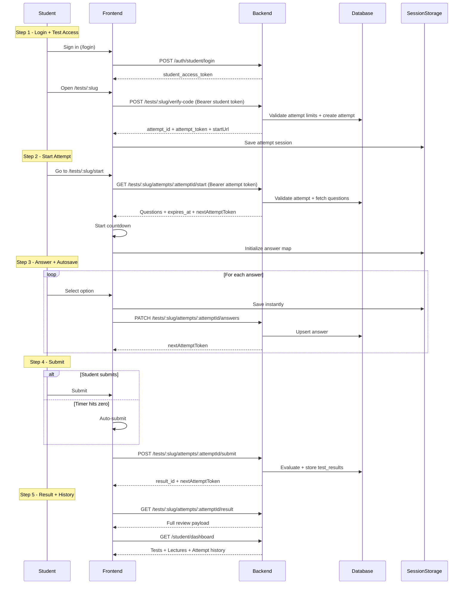

# Student Test Workflow

## Student Test Flow

## APIs

- `POST /api/auth/student/register`
- `POST /api/auth/student/login`
- `GET /api/auth/student/me`
- `GET /api/student/dashboard`
- `GET /api/student/results/:attemptId`
- `POST /api/tests/:slug/verify-code` (requires student login)
- `GET /api/tests/:slug/attempts/:attemptId/start`
- `PATCH /api/tests/:slug/attempts/:attemptId/answers`
- `POST /api/tests/:slug/attempts/:attemptId/submit`
- `GET /api/tests/:slug/attempts/:attemptId/result`

## Security + Access Rules

- Student must be authenticated before starting an attempt.
- Rate limiting uses Redis (`ratelimit:test-start:*`) with in-memory fallback.
- Attempt token uses nonce rotation: each protected call returns `nextAttemptToken`.
- Attempt caps are enforced by user id + student name + device fingerprint.

## Frontend Pages

- `/login` -> student login
- `/register` -> student account creation
- `/student` -> student portal (lectures, tests, result history)
- `/tests/:slug` -> test landing/start page
- `/tests/:slug/start` -> test runtime UI
- `/tests/:slug/result` -> immediate result page after submit
- `/student/results/:attemptId` -> historical result review page
