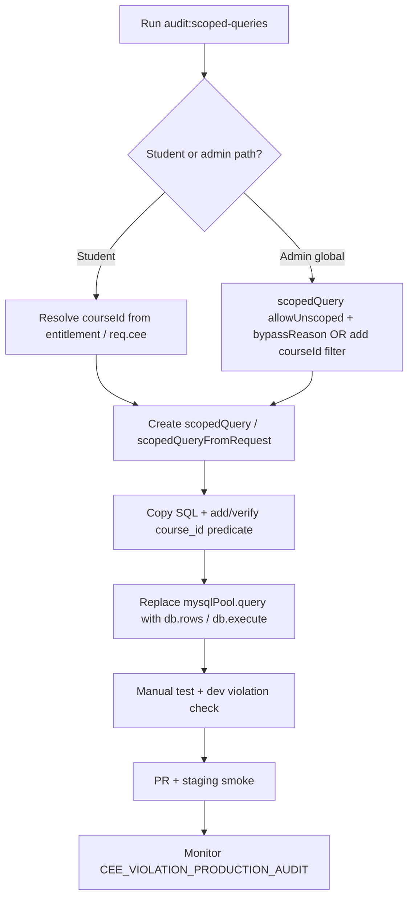

# Scoped Query Migration Guide

Production-safe pattern for converting raw `mysqlPool.query` calls into entitlement-scoped `scopedQuery()` access on CEE-protected instructional tables.

**Goal:** Reduce cross-course data leakage risk without changing API contracts or breaking paid student flows.

---

## Principles

| Principle | Practice |
|-----------|----------|
| **Fail-closed** | Student/instructional paths use `scopedQuery` with a valid `courseId` from entitlement — never optional scope |
| **Preserve behavior** | Same SQL predicates + params after migration; only the execution wrapper changes |
| **Gradual rollout** | One service/function per PR; student paths before admin |
| **Rollback-safe** | Query-only changes revert cleanly; no schema dependency for Phase 1 migration |
| **Verify in dev** | Unscoped SQL triggers CEE violation banners (`VIOLATION_DIAGNOSTICS.md`) before reaching production |

---

## Audit targets (CEE registry)

| Registry key | Table | Scope strategy | Required in SQL |
|--------------|-------|----------------|-----------------|
| `lectures` | `lectures` | `direct_course_id` | `lectures.course_id = ?` |
| `tests` | `tests` | `direct_course_id` | `tests.course_id = ?` |
| `questions` | `test_questions` | via `tests` | join + `tests.course_id = ?` |
| `test_attempts` | `test_attempts` | via `tests` | join + `tests.course_id = ?` |
| `results` | `test_results` | via `test_attempts` → `tests` | join chain + `tests.course_id = ?` |
| `chapters` | `chapters` | `via_foreign_key` | `subjects.course_id = ?` (join subjects) |
| `subjects` | `subjects` | `direct_course_id` | `subjects.course_id = ?` |
| `uploads` | (filesystem) | entitlement + namespace | `secureMedia.service` — not `scopedQuery` |

---

## Current inventory (migration backlog)

Run `npm run audit:scoped-queries` for a live report.

| Area | File | Status | Risk |
|------|------|--------|------|
| Lectures (student) | `studentPortal.service.js` | **Migrated** (`loadEntitledLectures`) | Low |
| Tests (student) | `studentPortal.service.js` | **Migrated** (`loadEntitledTests`) | Low |
| Results (student) | `studentPortal.service.js` | **Migrated** — `loadEntitledStudentResults` + `assertCourseAccess` + `scopedQuery` | Low |
| Result detail | `studentPortal.service.js` | **Migrated** — `getStudentResultByAttempt` + `scopedQuery` | Low |
| Test attempts | `testAttempt.service.js` | **Partial** — some paths scoped via joins, not guarded | High |
| Test entitlement | `testEntitlement.service.js` | Scoped SQL, raw executor | Medium |
| Lectures (admin) | `lecture.service.js` | Raw — `listLectures()` global | Admin — use bypass or course filter |
| Chapters / subjects | `chapter.service.js`, `subject.service.js` | Raw | Admin / mixed |
| Tests (admin) | `test.service.js` | Raw — global lists | Admin — bypass + audit |
| Uploads | `secureMedia.service.js` | Entitlement guard (not SQL) | Low if grid wired |

**Recommended order:** `loadStudentResults` → `testAttempt.service.js` → `getStudentResultByAttempt` → admin CRUD (with explicit bypass).

---

## Dangerous query detection patterns

Flag these during code review or with `scripts/audit-scoped-query-migration.mjs`:

```text
# Direct pool on protected tables (student services)
mysqlPool.query( ... FROM lectures|tests|chapters|subjects|test_attempts|test_results|test_questions

# Protected table without course_id literal/hint in same statement
FROM lectures WHERE ...   (no course_id)
FROM tests ORDER BY     (global listing)
FROM test_attempts WHERE user_id = ?   (user-only, missing course join)

# Slug-only test resolution (pre-CEE)
FROM tests WHERE public_slug = ?   (no course_id)

# SELECT * on instructional tables in student paths
SELECT * FROM lectures|tests
```

**Safe patterns:**

```sql
WHERE l.course_id = ?
WHERE t.course_id = ? AND t.status = 'published'
INNER JOIN tests t ON t.id = a.test_id AND t.course_id = ?
INNER JOIN subjects s ON s.id = ch.subject_id AND s.course_id = ?
```

---

## Recommended refactor workflow



### Per-function checklist

1. **Classify** — student instructional (must scope) vs admin (bypass or course-scoped).
2. **Source `courseId`** — `entitlement.courseId`, `req.cee.courseId`, or `resolveChapterOwnership().courseId` (never client-only).
3. **Factory** — `scopedQuery({ courseId, context: 'service.method', userId, route? })` or `scopedQueryFromRequest(req, context)`.
4. **SQL** — ensure `validateScopedQuery` passes (literal `course_id = ?` or registry join path).
5. **Swap executor** — `db.rows(sql, params)` / `db.first()` / `db.execute()`.
6. **Regression** — same row counts for entitled user; 403/empty for wrong course.
7. **Remove** — dead `mysqlPool` import if file no longer uses it.

---

## Rollback-safe strategy

| Layer | Rollback |
|-------|----------|
| **Code** | Revert PR — `scopedQuery` is a thin wrapper; restoring `mysqlPool.query` restores prior behavior |
| **Feature flag** | Optional env `CEE_SCOPED_QUERY_ENFORCE=false` is **not** recommended — guard is the safety net. Prefer revert over disabling guard |
| **Schema** | No migration required for scoped-query rollout |
| **Admin bypass** | Removing bypass without adding `course_id` filters re-opens global reads — document bypass reasons in PR |
| **Production audit** | `CEE_VIOLATION_PRODUCTION_AUDIT=true` — observe only; does not change query behavior |

**Staging validation before prod:**

```bash
NODE_ENV=development npm run audit:scoped-queries
# Hit dashboard / test attempt — confirm no CEE banners in logs
```

---

## Conversion patterns

### Pattern A — Student path with known `courseId` (most common)

**Before** (`studentPortal.service.js` — results still raw):

```js
async function loadStudentResults(studentId) {
  const [results] = await mysqlPool.query(
    `SELECT a.id AS attempt_id, t.title AS test_title, ...
     FROM test_attempts a
     INNER JOIN test_results r ON r.attempt_id = a.id
     INNER JOIN tests t ON t.id = a.test_id
     WHERE a.user_id = ?
     ORDER BY a.submitted_at DESC`,
    [studentId]
  );
  return results;
}
```

**After** (entitlement-scoped — preserves shape, adds course boundary):

```js
async function loadStudentResults(studentId, courseId) {
  const db = scopedQuery({
    courseId,
    context: 'studentPortal.loadStudentResults',
    userId: studentId,
  });
  return db.rows(
    `SELECT a.id AS attempt_id, t.title AS test_title, t.public_slug, a.submitted_at,
            r.score, r.max_score, r.percentage
     FROM test_attempts a
     INNER JOIN test_results r ON r.attempt_id = a.id
     INNER JOIN tests t ON t.id = a.test_id AND t.course_id = ?
     WHERE a.user_id = ?
     ORDER BY a.submitted_at DESC`,
    [courseId, studentId]
  );
}

// In getStudentDashboard:
loadStudentResults(studentId, courseId),
```

### Pattern B — HTTP handler (`scopedQueryFromRequest`)

**Before:**

```js
export async function getLecture(req, res) {
  const [rows] = await mysqlPool.query(
    `SELECT id, title FROM lectures WHERE id = ?`,
    [req.params.id]
  );
}
```

**After:**

```js
import { scopedQueryFromRequest } from '../security/cee/db/scopedQuery.js';

export async function getLecture(req, res) {
  const db = scopedQueryFromRequest(req, 'lectures.getById');
  const row = await db.first(
    `SELECT id, title FROM lectures WHERE id = ? AND course_id = ? LIMIT 1`,
    [req.params.id, db.courseId]
  );
}
```

### Pattern C — Hierarchy tables (`chapters` / `subjects`)

Chapters have no `course_id` column — scope via join (registry `joinPath`):

**Before:**

```js
const [rows] = await mysqlPool.query(
  `SELECT ch.id, ch.title FROM chapters ch WHERE ch.subject_id = ?`,
  [subjectId]
);
```

**After:**

```js
const db = scopedQuery({ courseId, context: 'chapter.listBySubject', userId });
const rows = await db.rows(
  `SELECT ch.id, ch.title
   FROM chapters ch
   INNER JOIN subjects s ON s.id = ch.subject_id AND s.course_id = ?
   WHERE ch.subject_id = ? AND ch.is_active = TRUE`,
  [courseId, subjectId]
);
```

### Pattern D — Test attempts + questions

**Before:**

```js
const [questions] = await mysqlPool.query(
  `SELECT id, question_text FROM test_questions WHERE test_id = ?`,
  [testId]
);
```

**After:**

```js
const db = scopedQuery({ courseId: entitlement.courseId, context: 'testAttempt.loadQuestions', userId });
const questions = await db.rows(
  `SELECT q.id, q.question_text
   FROM test_questions q
   INNER JOIN tests t ON t.id = q.test_id AND t.course_id = ?
   WHERE q.test_id = ?`,
  [entitlement.courseId, testId]
);
```

### Pattern E — Admin global list (audited bypass, not student-safe)

Use only on `/api/admin/*` with admin auth — never on student routes.

```js
import { scopedQueryBypass } from '../security/cee/db/scopedQuery.js';

export async function listAllTestsAdmin(adminUserId) {
  const db = scopedQueryBypass({
    reason: 'admin_job:tests_global_list_v2',
    context: 'admin.tests.listAll',
    userId: adminUserId,
  });
  return db.rows(`SELECT * FROM tests ORDER BY created_at DESC`);
}
```

Prefer **course-scoped admin** when the UI has a course context:

```js
const db = scopedQuery({ courseId, context: 'admin.tests.listByCourse', userId: adminUserId });
return db.rows(`SELECT * FROM tests WHERE course_id = ? ORDER BY created_at DESC`, [courseId]);
```

### Pattern F — Uploads (non-SQL)

Uploads are not migrated to `scopedQuery`. Keep `secureMedia.service.js` + CEE grid on `/api/uploads/*`:

```js
await requireEntitlement(userId);
// filename prefix check for student-qa namespace
```

### Pattern G — Transactions

Pass a scoped runner with a connection-scoped executor:

```js
const connection = await mysqlPool.getConnection();
try {
  await connection.beginTransaction();
  const db = scopedQuery(
    { courseId, context: 'testAttempt.submit', userId },
    connection
  );
  await db.execute(`UPDATE test_attempts ... JOIN tests t ON t.course_id = ?`, [courseId, ...]);
  await connection.commit();
} finally {
  connection.release();
}
```

### Pattern H — One-shot without retaining runner

```js
import { scopedQueryOnce } from '../security/cee/db/scopedQuery.js';

const rows = await scopedQueryOnce({
  courseId,
  context: 'testEntitlement.resolveBySlug',
  userId,
  sql: `SELECT id, title FROM tests WHERE public_slug = ? AND course_id = ? LIMIT 1`,
  params: [slug, courseId],
});
```

---

## Regression prevention

| Check | Command / action |
|-------|------------------|
| Static audit | `npm run audit:scoped-queries` (CI-friendly, exit 1 on student violations) |
| Dev violations | `NODE_ENV=development` — exercise endpoint; no `CEE SECURITY VIOLATION` banner |
| Entitlement tests | Student with course A must not see course B lectures/tests/results |
| API contract | Response JSON shape unchanged (field names, array lengths for entitled user) |
| Admin bypass | Every `allowUnscoped` has reason ≥12 chars; appears in `[cee.scope.audit]` |

---

## Automated detection

**Script:** `server/scripts/audit-scoped-query-migration.mjs`

```bash
npm run audit:scoped-queries
```

**CI idea** — add to PR checks:

```yaml
- run: npm run audit:scoped-queries
  working-directory: Mrb-site/server
```

**ESLint (future)** — custom rule: ban `mysqlPool.query` in `src/services/student*.js` and `testAttempt.service.js` except allowlist comments.

**Grep pre-commit (future):**

```bash
rg "mysqlPool\.query" src/services/studentPortal src/services/testAttempt \
  && echo "FAIL: use scopedQuery in student instructional services"
```

---

## PR template (copy into description)

```markdown
## Scoped query migration
- [ ] Service: ___
- [ ] Path type: student | admin (bypass reason: ___)
- [ ] Tables: lectures | tests | chapters | subjects | results | attempts
- [ ] `courseId` source: entitlement | req.cee | chapter ownership
- [ ] `npm run audit:scoped-queries` passes
- [ ] Manual: entitled student dashboard / test flow unchanged
- [ ] No new global `FROM <protected_table>` without scope
```

---

## Related docs

- `CEE.md` — protection grid
- `diagnostics/VIOLATION_DIAGNOSTICS.md` — dev violation output
- `protectedTableRegistry.js` — join paths and scope strategies
- `db/scopedQuery.js` — API reference
